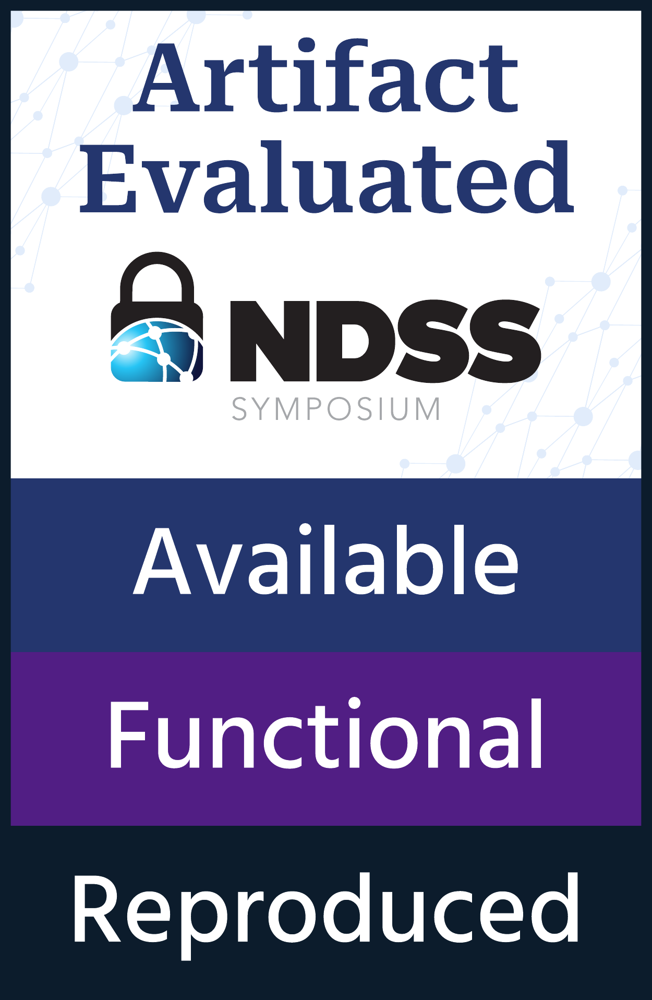

[](https://github.com/llvm/llvm-project/blob/release/19.x/LICENSE.TXT)
[](https://doi.org/10.5281/zenodo.13687049)


# type++: Prohibiting Type Confusion with Inline Type Information

The rest of this document will walk you trough replicating the results from our [paper](https://www.ndss-symposium.org/wp-content/uploads/2025-53-paper.pdf):
[`type++: Prohibiting Type Confusion with Inline Type
Information`](https://hexhive.epfl.ch/publications/files/22NDSS.pdf) (DOI:[10.14722/ndss.2025.23053](https://dx.doi.org/10.14722/ndss.2025.23053)) published in NDSS'25.
Additonally, the complete artifact can be found on [Zenodo](https://zenodo.org/records/13687049), [DOI:10.5281/zenodo.13687049](https://doi.org/10.5281/zenodo.13687049).

### Citation
```

@inproceedings{Badoux_type_Prohibiting_Type_2025,
  author = {Badoux, Nicolas and Toffalini, Flavio and Yuseok, Jeon and Payer, Mathias},
  booktitle = {32th Annual Network and Distributed System Security Symposium, \{NDSS\} 2025, San Diego, California, USA, February 23 - 28, 2025,},
  doi = {10.14722/ndss.2025.23053},
  month = feb,
  publisher = {The Internet Society,},
  title = {{type++: Prohibiting Type Confusion with Inline Type Information}},
  url = {https://dx.doi.org/10.14722/ndss.2025.23053},
  year = {2025}
}
```

### Repository layout
The repository is originally a fork of LLVM 13.0.0. The type++ code is commited
in the respective folder of the LLVM project ([clang](./clang), [LLVM](./llvm),
etc...).  Lastly, in the [Type++](./Type++/) folder, you can find all the
scripts to run the different experiments. 

- For SPEC CPU:
[patches](./Type++/spec_cpu/patch), [scripts to run the
experiments](./Type++/spec_cpu/run.py), and [get the results](./Type++/script/).

- For Chromium [patches](./Type++/chromium/patch), [scripts to build the
project](./Type++/chromium/build_chromium.sh), and [scripts to run the
experiments](./Type++/chromium/eval/eval.sh) are located in the
[Type++/chromium](./Type++/chromium) folder.

- Our microbenchmark is located under
the [Type++/metadata-eval](./Type++/metadata-eval) folder.

The LLVM code is released under the Apache License v2.0 with LLVM Exceptions. The type++ code follows the same license. 



## Artifact Evaluation

**Getting Started:**  
If it is your first time, you should start from [building from source](#build-from-source).

**Advanced Topics:**  
These are guides to test advanced features of type++ that fall out of the
artifact evaluation scope.
- If you have installed all the binaries, you can jump to the [Evaluation](#evaluation)
- If you want to use type++ in your project, check [Usage](#usage)
- For replicating related works, go for [Competitors](./COMPETITORS.md)
- We document the [Type Confusion](./Type++/spec_cpu/type_confusions.md) found

**Troubleshooting:** We collect a list of commong issues and easy workaround [here](#troubleshooting).


## Build from source

**Disclaimer:** since many steps run for a few hours, we recommend you
operate in a **tumx** session to avoid loosing partial results or environment
values. Additionally, type++ is still a research prototype with a liberal amount
of logging still enabled. Errors or warnings messages can be printed as part of
the build process (especially the warning analysis). 

### Installation

The following instructions have been tested on a fresh install of Ubuntu 20.04.
We require at least 16GB of RAM for SPEC CPU benchmarks and 128GB of RAM if you
want to build and run Chromium. 
A folder, `typepp` will be created in your `$HOME` folder. 

### Getting type++ code and initial requirements
```bash
sudo apt install -qq -y python3-pip git curl tmux
export REPO=https://github.com/HexHive/typepp.git
export BRANCH=main
export DEPTH=100
git clone $REPO --single-branch --branch $BRANCH --depth $DEPTH typepp
cd typepp
```

### Requirements
Install dependencies (Docker and a VNC server to run Chromium not in headless mode).
```bash
pip install -r requirements.txt

# Chromium specific prerequisites: Install a vnc server
sudo apt install -qq -y tightvncserver x11-apps unzip 

mkdir -p ${HOME}/.vnc
echo 123456 | vncpasswd -f > ${HOME}/.vnc/passwd
sudo chown -R $USERNAME:$USERNAME ${HOME}/.vnc
sudo chmod 0600 ${HOME}/.vnc/passwd
tightvncserver
DISPLAY=:1 xhost +localhost

# Install Docker in case it is missing
if docker buildx ; then
  echo "docker buildx already installed"
else 
  curl -sSL https://get.docker.com/ | sudo sh
  sudo groupadd docker || true
  sudo usermod -aG docker $USER
  sudo systemctl start docker
  newgrp docker
  docker run hello-world
fi
```

### Dependencies
Retrieve the proprietary SPEC benchmarks.

```bash
# Retrieve the SPEC benchmarks.

# NOTE: I assume you have SPEC CPU 2006 and 2017 .iso in your home folder.
# If it is not your case, make sure to copy the .iso into typepp folder
# before continuing 
cd ${HOME}/typepp
mv ${HOME}/cpu2006-1.2.iso .
mv ${HOME}/cpu2017-1.1.8.iso .
```

### Building type++

To build type++, you can simply run the two following lines. It should take
around *three* hours to build on a i7-8700 CPU @ 3.20GHz with
6 physical cores.
```bash
export DOCKER_BUILDKIT=1
cd ${HOME}/typepp
docker build . --target typepp -t typepp
```

To ease the deployment of our evaluation, we created different Docker images with each configuration. For a smooth evaluation, please build the different images now. 

#### Docker images for SPEC benchmarks
```bash
# we build SPEC CPU 2006 and 2017 in three modes: reference, w/ LLVM-CFI, 
# and w/ type++
cd ${HOME}/typepp
docker build . --target cpu_reference -t cpu_reference
docker build . --target cpu_cfi -t cpu_cfi
docker build . --target cpu_typepp -t cpu_typepp

# these builds allow the collection of cast statistics
docker build . --target cpu_cfi_stats -t cpu_cfi_stats
docker build . --target cpu_typepp_stats -t cpu_typepp_stats

# these builds allow the collection of memory measurements
docker build . --target memory_reference -t memory_reference
docker build . --target memory_typepp -t memory_typepp

# these builds measure the overhead w/ our patches and warning analysis
docker build . --target cpu_typepp_analysis -t cpu_typepp_analysis
```

#### Docker images for the micro-benchmark
```bash
docker build . --target microbenchmark -t microbenchmark
```

#### Docker images for the Chromium case study
In addition to creating the images, this will fetch the Chromium source code and
some of its dependencies.  This step will compile Chromium *five* times
(baseline, type++_perf, cfi_coverage, type++_coverage, type++_warnings). This is
likely to take multiple days (e.g., on a Xeon E5-2680 v4 @ 2.40GH with 56 cores
and 256GB of RAM).

```bash
# We download our patched Chromium version
cd ${HOME}/typepp
export DEPTH=100
export CHROMIUM_REPO=https://github.com/vwvw/chromium
export CHROMIUM_BRANCH_BASELINE=typepp
export CHROMIUM_BRANCH_TYPEPP=typepp-partial-changes
export CHROMIUM_FOLDER=${HOME}/typepp/Type++/chromium
git clone $CHROMIUM_REPO --single-branch --branch $CHROMIUM_BRANCH_BASELINE ${CHROMIUM_FOLDER}/chromium-baseline --depth $DEPTH
git clone $CHROMIUM_REPO --single-branch --branch $CHROMIUM_BRANCH_TYPEPP ${CHROMIUM_FOLDER}/chromium-typepp --depth $DEPTH

# we build five versions of Chromium: baseline, cfi, typepp, cfi+statistics, and typepp+statistics
# /!\ THIS WILL TAKE AROUND 400GB OF DISK SPACE AND MORE THAN A DAY TO BUILD
chmod 777 -R ${HOME}/typepp/Type++/chromium/eval
${HOME}/typepp/Type++/chromium/build_baseline.sh
${HOME}/typepp/Type++/chromium/build_cfi.sh
${HOME}/typepp/Type++/chromium/build_typepp.sh
${HOME}/typepp/Type++/chromium/build_cfi_stats.sh
${HOME}/typepp/Type++/chromium/build_typepp_stats.sh
```

You should now have all the necessary images to run the full evaluation. Please proceed to the [Evaluation](#evaluation) section.

## Evaluation

**Disclaimer1:** since many steps require a long processing time, we recommend you
operate in a **tumx** session to avoid losing partial results or environment
settings.

**Disclaimer2:** we also assume the repository is cloned into the `HOME` folder as per [installation](#build-from-source).
Therefore, all the commands are assumed to be launched from `${HOME}/typepp`.
```bash
cd ${HOME}/typepp
```

### Running SPEC (Table I & II)
We will first run all the different configurations to collect the data for the complete tables.

The execution time of the next four sections may vary between few hours and a
day on a i7-8700 CPU @ 3.20GHz with 6 physical cores.

#### Performance runs
The number of repetition is controlled by the `NUMBER_OF_ITERATION` variable.
```bash
# For the paper we used 5, for the artifact one is sufficient 
# to obtain the same results
export NUMBER_OF_REPLICATION=1 
export DOCKER_BUILDKIT=1 

cd ${HOME}/typepp
mkdir -p results
# run the experiment
docker run --env NUMBER_OF_ITERATION=$NUMBER_OF_REPLICATION --name cpu_reference_container -t cpu_reference
# collect the results
docker container cp  cpu_reference_container:/home/typeppUSER/results results_baseline
cat results_baseline/runtime_performance.csv >> ./results/runtime_performance.csv

# run the experiment
docker run --env NUMBER_OF_ITERATION=$NUMBER_OF_REPLICATION --name cpu_cfi_container -t cpu_cfi 
# collect the results
docker container cp  cpu_cfi_container:/home/typeppUSER/results results_cfi
cat results_cfi/runtime_performance.csv >> ./results/runtime_performance.csv

# run the experiment
docker run --env NUMBER_OF_ITERATION=$NUMBER_OF_REPLICATION --name cpu_typepp_container -t cpu_typepp 
# collect the results
docker container cp  cpu_typepp_container:/home/typeppUSER/results results_typepp
cat results_typepp/runtime_performance.csv >> ./results/runtime_performance.csv
```  
#### Type confusions coverage runs

Since SPEC CPU is deterministic, one run is sufficient.

```bash
export DOCKER_BUILDKIT=1 

cd ${HOME}/typepp
# run the experiment
docker run --env NUMBER_OF_ITERATION=1 --name cpu_cfi_stats_container -t cpu_cfi_stats 
# collect the results
docker container cp  cpu_cfi_stats_container:/home/typeppUSER/results results_cfi_stats
cp results_cfi_stats/total_result* results

# run the experiment
docker run --env NUMBER_OF_ITERATION=1 --name cpu_typepp_stats_container -t cpu_typepp_stats 
# collect the results
docker container cp  cpu_typepp_stats_container:/home/typeppUSER/results results_typepp_stats
cp results_typepp_stats/total_result* results
```  
#### Memory runs
The number of repetition is controlled by the `NUMBER_OF_ITERATION` variable.
```bash
# For the paper we used 5, for the artifact one is sufficient 
# to obtain the same results
export NUMBER_OF_REPLICATION=1
export DOCKER_BUILDKIT=1 

cd ${HOME}/typepp
# run the experiment
docker run --env NUMBER_OF_ITERATION=${NUMBER_OF_REPLICATION} --name memory_reference_container -t memory_reference
# collect the results
docker container cp  memory_reference_container:/home/typeppUSER/results results_baseline_memory
cp results_baseline_memory/total_result_memory_baseline_* ./results/

# run the experiment
docker run --env NUMBER_OF_ITERATION=${NUMBER_OF_REPLICATION} --name memory_typepp_container -t memory_typepp 
# collect the results
docker container cp  memory_typepp_container:/home/typeppUSER/results results_typepp_memory
cp results_typepp_memory/total_result_memory_vtype_* ./results/
```
#### Warnings runs
The warning analysis needs only one repetition.
```bash
cd ${HOME}/typepp
# run the experiment
docker run --env NUMBER_OF_ITERATION=1 --name cpu_typepp_analysis_container -t cpu_typepp_analysis 
# collect the results
docker cp cpu_typepp_analysis_container:/home/typeppUSER/results/ results_typepp_analysis
```  

### Table I: Warning Analysis

The table containst the resutls from the warning analysis. We further provide the patches for [SPEC CPU](./Type++/spec_cpu/patch).

```bash
cd ${HOME}/typepp
cat ./results_typepp_analysis/analysis_result_test.tex
```

### Table II: Performance overhead, memory overhead, and type confusion coverage

The table contains both runtime overhead, memory overhead, and type confusion
coverage. The raw logs are stored in the `results` folder. Run the following
command to reproduce Table I from our paper. 

```bash
cd ${HOME}/typepp
export RESULT_FOLDER=./results
./Type++/script/getmemoryoverhead.py &&  ./Type++/script/getperformanceresult.py
```


### Table V: Micro benchmark
The following command should print the different numbers for the Table V in our paper. 
```bash
docker run --name microbenchmark_container -t microbenchmark
```

### Table VI: Running Chromium
This step will run the JetStream benchmark on the different instances of
Chromium. The last line reports the results in a table. 
As the run is non-deterministic, there might be some variance in the results. 

```bash
cd ${HOME}/typepp
chmod 777 -R ${HOME}/typepp/Type++/chromium/eval
mkdir -p results

${HOME}/typepp/Type++/chromium/run_baseline.sh
${HOME}/typepp/Type++/chromium/run_cfi.sh
${HOME}/typepp/Type++/chromium/run_typepp.sh
${HOME}/typepp/Type++/chromium/run_cfi_stats.sh
${HOME}/typepp/Type++/chromium/run_typepp_stats.sh

export RESULT_FOLDER=./results
${HOME}/typepp/Type++/chromium/gettable.py

```

## Usage

The most convenient way to use type++ is to enter the `typepp` container provided.

To do that, first build the Docker image and run it. 
```bash
export DOCKER_BUILDKIT=1
docker build . --target typepp -t typepp
docker run -it typepp zsh
```

Once inside the Docker container, you will find the Clang binary in `/home/typeppUSER/build/bin/clang++`.

A guide to the different options of type++ can be found in the [Type++](./Type++/README.md#usage) folder.

### Minimal example

We provide a minimal example in the [`Type++/example`](./Type++/example) folder.
To run it, simply execute the following commands that build and run the Docker container containing the example: 
```bash
docker build . --target example_typepp -t example_typepp
docker run -it example_typepp zsh
```

Then follow the instructions in the [README](./Type++/example/README.md) file.

## Troubleshooting

### Disk space issue

The different Docker images require quite some space. If you run out of space,
you can remove specific container with `docker rm $CONTAINER_ID` or run [`docker
system prune`](https://docs.docker.com/reference/cli/docker/system/prune/) which
removes dangling images and containers. This might, however, require to rebuild
some images via the respective `docker build` command. 

### Container name already in use

If you want to rerun the evaluation, you will first need to remove the named
containers as the name has to be unique. Simply execute `docker rm
$CONTAINER_NAME` before relaunching the evaluation. If the evaluation was is
still running, first kill the container via `docker kill $CONTAINER_NAME`.


### Error when fetching Chromium dependencies

We encountered a few times that the download of the Chromium dependencies
failed. This can be due to a network issue. In this case, we advise on
relaunching the build script. 

### Permission issue inside the Docker container

The whole artifact folder is mounted inside the Docker containers. Any
modification to the permissions of the folder will be reflected inside the
container. In particular, if the owner of the folder is changed, the ID inside
the container will not match the owner of the files resulting in permission
issues.  If you encounter this problem, you should reset the permissions inside
the container with the `chown -R $USER:$USER` command. To access inside the
container, you can use the `docker exec -it $CONTAINER_ID zsh` command.
