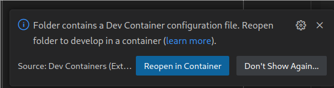

[](https://github.com/llvm/llvm-project/blob/release/19.x/LICENSE.TXT)
# type++

type++ can be run locally, in a Docker container, or with the help of [Visual
Studio Code dev
container](https://code.visualstudio.com/docs/devcontainers/containers)
features.

The LLVM code is released under the Apache License v2.0 with LLVM Exceptions. The type++ code follows the same license. 

## Environment

### Docker container
```bash
export DOCKER_BUILDKIT=1
cd ${HOME}/typepp
docker build . --target typepp -t typepp
docker run -it typepp --name typepp_container zsh
```

### Visual Studio Dev Container setup (Recommended)

First run the init script to install `dockerx` and allow VNC into the Docker
container. The script will also build the Docker images. 
```bash
cd typepp/type++
./container_init.sh
```

Once this is done, open the folder `typepp` in a new Visual Studio Code
window. A prompt should suggest you to either install the dev container
extension or to launch let Visual Studio launch the container. Click `Reopen in
Container`.



### How to build locally

```bash
sudo apt-get -q update
sudo apt-get install -qq -y git clang \
	clang-12 wget tar build-essential make ninja-build cmake \
	vim python3-distutils ccache zip \
	python3-dotenv python3 make  python texinfo bison p7zip-full p7zip-rar \
  devscripts libmpc-dev python3-pip
cd typepp/type++
pip3 install -r requirements.txt

cd ..
./fetch_repos.sh
./build.sh
```

## Usage
type++ has four different kind of options: 

1. Compile-time configuration to choose how to react to type confusion (e.g.,
abort, print to stdout, log to file).

2. Clang-like arguments to enable type++ and its features (e.g., collection of
classes, verification of derived casts...)

3. A file to restrict instrumentation to only a set of classes allowing Property
3 from our paper. 

4. A list of custom allocator functions to be recognized by type++ (currently
hardcoded in the source code but will be exposed as a file in future work).

The configuration present by default recognize the libc++ custom allocator
functions as well as the ones from the SPEC CPU benchmarks. It is also
configured to not abort the program when type confusion is detected, nor log it
anywhere to allow for performance measurement. 

### (Optional) Configure logging behaviour

Please enable/disable below `#define` in the
[LLVM/src/compiler-rt-files/typeplus.h](./LLVM/src/compiler-rt-files/typeplus.h)
according to your needs:

- `HEX_LOG`: print numerical statistics (should be enabled when you select any
of the following options)

- `PRINT_BAD_CASTING_STATS`: print stats about how many cast were veirified
(enabled by default)

- `PRINT_BAD_CASTING_STDOUT`: print type confusion result to `stdout`

- `PRINT_BAD_CASTING_FILE`: print type confusion result into file

- `PRINT_BAD_CASTING_STDERR`: print type confusion result using `stderr`

- `PRINT_BAD_CASTING_FATAL`: terminate program when type++ detects type
confusion

- `PRINT_MISSED_CAST`: enable logging of missed casts in case of a incomplete
class target list

Any changes to theses options imply a new build of type++ via the `./build.sh`
command.

### Setting up the environment variables

First, we need to define a location for the logs of type++. Additionaly,
`TARGET_TYPE_LIST_PATH` will point to the file where the classes to instrument
will be collected. 

```bash
export TYPEPLUS_LOG_PATH="/tmp/" # Log folder
export TARGET_TYPE_LIST_PATH=${TYPEPLUS_LOG_PATH}"/merged.txt" # This file will collect all classes that need to be instrumented.
```

### Running type++

##### Build environment variables

To ease the use of type++, we provide a list of environment variable pointing to
the different elements of type++. If you are running inside the Docker
container, this should not be necessary.

```bash 
cp environment_template.sh environment_patched.sh
# do you own modification to the file
source ./environment_patched.sh
```


#### Clang options

We extended Clang with a new options to enable type++ and its different
features.  Please use below options as compile arguments (with `-mllvm` option,
e.g., `-mllvm -create-derived-cast-type-list`) according to your purpose

- `create-derived-cast-type-list`: to create base-to-derived casting related
type set

> The `TYPEPLUS_LOG_PATH` enviroment variable need to be set

- `create-unrelated-cast-type-list`: to create unrelated casting related type
set

> The `TYPEPLUS_LOG_PATH` enviroment variable need to be set

- `apply-vtable-standard`: to insert vtable into standard layout class also

- `cast-obj-opt`: to insert vtable into only casting related object tracing
optimization 

> The`TARGET_TYPE_LIST_PATH` enviroment variable need to be set

- `check-base-to-derived-casting`: to detect Base-to-derived cast to the wrong
dynamic type

- `check-unrelated-casting`: to detect casting from void* or another unrelated
type to the wrong dynamic type

- `collect-profiling-data`: to collect/print profiling data (to print out
coverage)
 
##### Property 2 optimization: Inserting vtable only into casting related object

The binary need to be compiled twice: 

1. First, we need to create a typecasting-related object set (using `-mllvm
-create-derived-cast-type-list` and/or `-llvm -create-unrelated-cast-type-list`
options).  If the created lists has duplicated function name, you can
deduplicate them by using this [Python
script](Type++/script/merge_typecasting_related_type.py). 

2. Secondly, you should do another compilation with the `-llvm -cast-obj-opt`
option. This compilation will read from `TARGET_TYPE_LIST_PATH` and only
instrument the classes that are in the pointed file. This allows also to use
Property 3 with a limited set of classes manually selected. 

### Example
Here is a minimal example highliting the detection of type confusion caused by
wrong derived casting.  

#### Test code (`sample.cpp`) 

```c++
#include<iostream>
  
using namespace std;

class S {
 int t;
};

class T : public S {
  int m;
};

int main() {
  S* ps = new S;
  T* pt = static_cast<T*>(ps); // bad-casting!
  return 1;
}
```

#### Set enviroment variable 

```bash
export TYPEPLUS_LOG_PATH="/tmp/sample"
export TARGET_TYPE_LIST_PATH=${TYPEPLUS_LOG_PATH}"/merged.txt"
export LD_LIBRARY_PATH=${BUILD_FOLDER}/../libunwind-build/lib
mkdir -p ${TYPEPLUS_LOG_PATH}
```

#### Compile with original Clang to ensure the porgram is C++ compliant with respects to default constructors rules

```bash
${BUILD_FOLDER}/bin/clang++ sample.cpp -Wall
```

#### Create casting related object list 

```bash
${BUILD_FOLDER}/bin/clang++ sample.cpp \
    -stdlib=libc++ -nostdinc++ \
    -Wl,-rpath,${BUILD_FOLDER}/../libcxx-build/lib \
    -L${BUILD_FOLDER}/../libcxx-build/lib \
    -I${BUILD_FOLDER}/../libcxx-build/include/c++/v1 \
    -Wl,-rpath,${BUILD_FOLDER}/../libcxxabi-build/lib \
    -L${BUILD_FOLDER}/../libcxxabi-build/lib \
    -Wl,-rpath,${BUILD_FOLDER}/../libunwind-build/lib \
    -L${BUILD_FOLDER}/../libunwind-build/lib \
    -fsanitize=typeplus \
    -flto \
    -fvisibility=hidden \
    -mllvm -create-derived-cast-type-list
```

#### Merge class files 

The classes collected can be spread out to multiple files if the compiler used
multiple processes. In this case, we first need to merge all this files
together. 

```bash
${LLVM_FOLDER}/Type++/script/merge_typecasting_related_type.py ${TYPEPLUS_LOG_PATH} > ${TARGET_TYPE_LIST_PATH}
```

#### Compile

```bash
${BUILD_FOLDER}/bin/clang++ sample.cpp \
    -stdlib=libc++ -nostdinc++ \
    -Wl,-rpath,${BUILD_FOLDER}/../libcxx-build/lib \
    -L${BUILD_FOLDER}/../libcxx-build/lib \
    -I${BUILD_FOLDER}/../libcxx-build/include/c++/v1 \
    -Wl,-rpath,${BUILD_FOLDER}/../libcxxabi-build/lib \
    -L${BUILD_FOLDER}/../libcxxabi-build/lib \
    -Wl,-rpath,${BUILD_FOLDER}/../libunwind-build/lib \
    -L${BUILD_FOLDER}/../libunwind-build/lib \
    -fsanitize=typeplus \
    -flto \
    -fvisibility=hidden \
    -mllvm -apply-vtable-standard \
    -mllvm -poly-classes \
    -mllvm -cast-obj-opt \
    -mllvm -check-base-to-derived-casting \
    -mllvm -collect-profiling-data \
    -mllvm -check-unrelated-casting
```

#### Run the binary
As we enabled ` -mllvm -collect-profiling-data`, the binary will print a summary in `TYPEPLUS_LOG_PATH` folder. 
```bash
rm -drf ${TYPEPLUS_LOG_PATH}/total_result.txt
./a.out
cat ${TYPEPLUS_LOG_PATH}/total_result.txt
```
If you want more details on the type confusion (e.g., line number), you can
enable either `PRINT_BAD_CASTING_FILE` or `PRINT_BAD_CASTING_STDOUT` in the
[`typeplus.h`](LLVM/src/compiler-rt-files/typeplus.h) file before recompiling
type++ via the `build.sh ` script.
